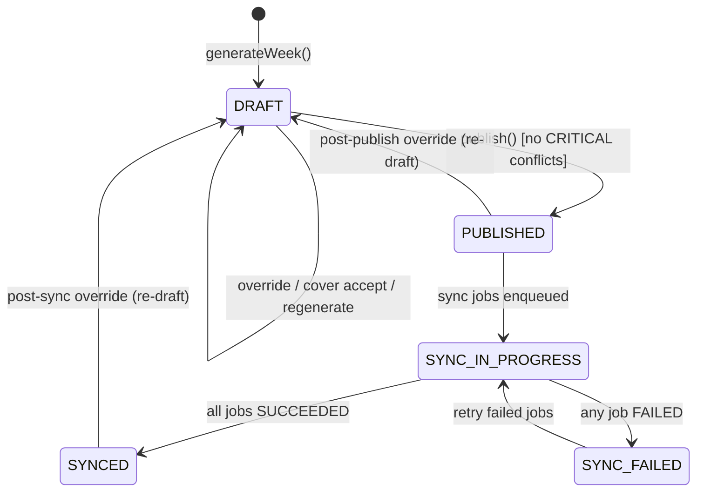
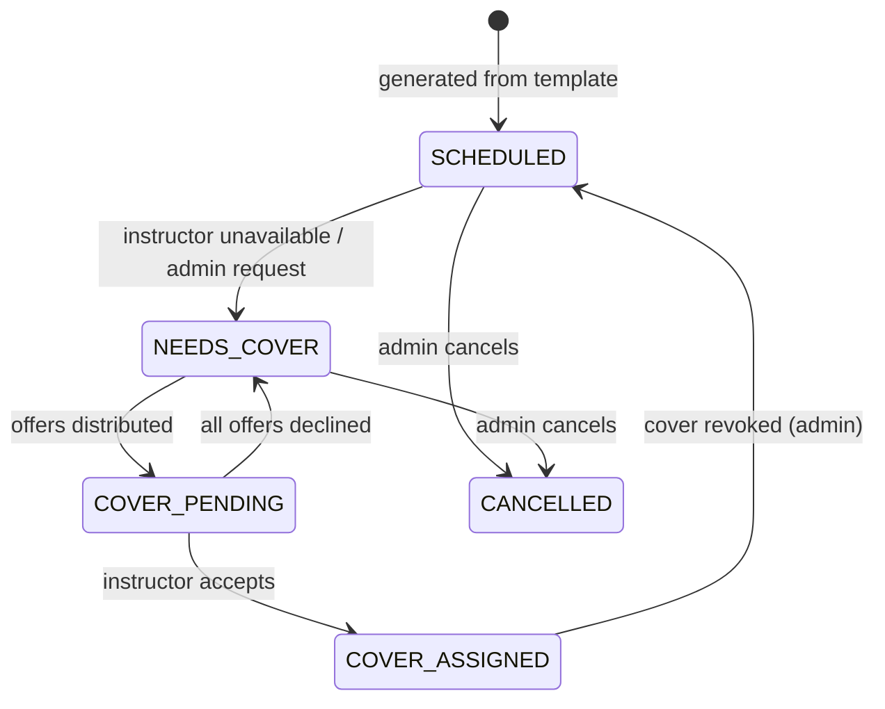

# RosterSyncOS State Machine

## Week Pipeline States

---

## Week Transition Table

| From | To | Trigger | Preconditions | Postconditions | Audit Event | Tests |
|------|------|---------|--------------|----------------|-------------|-------|
| (none) | DRAFT | `generateWeek(studioId, weekStart)` | Studio exists, weekStart is valid Monday | Week record created, sessions generated from templates | `WEEK_GENERATED` | Idempotent generation test |
| DRAFT | DRAFT | Override/cover accept | Week is DRAFT | Session fields updated, audit logged | `SESSION_OVERRIDE` or `COVER_ACCEPTED` | Override applies correctly |
| DRAFT | PUBLISHED | `publish(weekId, userId)` | No CRITICAL conflicts, week is DRAFT | weekHash computed, publishedAt set, sync jobs enqueued | `PUBLISH_WEEK` | Blocking conflict prevents publish; double publish returns existing |
| PUBLISHED | DRAFT | Post-publish override | Admin action on published week | Status reverts to DRAFT, weekHash cleared | `WEEK_REDRAFTED` | Re-draft clears publish state |
| PUBLISHED | SYNC_IN_PROGRESS | Sync jobs begin processing | WixSyncJobs exist for this week | Jobs move to PROCESSING | (tracked per job) | Jobs created on publish |
| SYNC_IN_PROGRESS | SYNCED | All jobs SUCCEEDED | Every session sync job for this publish is SUCCEEDED | Week fully synced | `SYNC_COMPLETED` | All jobs pass |
| SYNC_IN_PROGRESS | SYNC_FAILED | Any job FAILED | At least one job in FAILED status | Partial sync state | `SYNC_FAILED` | Failure captured with error |
| SYNC_FAILED | SYNC_IN_PROGRESS | `retryJob(jobId)` | Job exists in FAILED status | Job reset to PENDING, attempts reset | `SYNC_RETRIED` | Retry resets job |

---

## Session-Level States

### Session Transition Table

| From | To | Trigger | Preconditions | Postconditions |
|------|------|---------|--------------|----------------|
| (none) | SCHEDULED | Week generation | Template exists with defaults | Base fields populated |
| SCHEDULED | NEEDS_COVER | Unavailability detected / admin request | Session exists, instructor conflict detected | CoverOpportunity created |
| NEEDS_COVER | COVER_PENDING | Offers distributed | CoverOpportunity OPEN, eligible instructors found | CoverOffers created, opportunity status → OFFERED |
| COVER_PENDING | COVER_ASSIGNED | Instructor accepts | Offer is PENDING, opportunity is OFFERED | Override fields set, compatibility resolved, opportunity → ASSIGNED |
| COVER_PENDING | NEEDS_COVER | All decline | All offers DECLINED | Opportunity reverts to OPEN for re-offer |
| SCHEDULED | CANCELLED | Admin cancels | Session exists | Status → CANCELLED |

---

## Forbidden Transitions

These transitions must NEVER occur:

1. **PUBLISHED → PUBLISHED** — Cannot re-publish without going through DRAFT first (idempotent publish returns existing, it does not create a new version).
2. **DRAFT → SYNCED** — Cannot sync without publishing first.
3. **COVER_ASSIGNED → COVER_PENDING** — Once assigned, cover cannot revert to pending (admin must explicitly revoke).
4. **CANCELLED → SCHEDULED** — Cancelled sessions cannot be reactivated (create a new session instead).
5. **Any state → Any state without audit** — Every transition MUST emit an audit event.

---

## Concurrency Rules

| Scenario | Resolution |
|----------|-----------|
| Two admins publish simultaneously | Database transaction ensures only one publish succeeds; second gets idempotent return |
| Two instructors accept same cover | `CoverOffer` update uses optimistic lock — first ACCEPT wins, second gets 400 |
| Override during sync | Override succeeds, week reverts to DRAFT, existing sync jobs complete but new publish needed |
